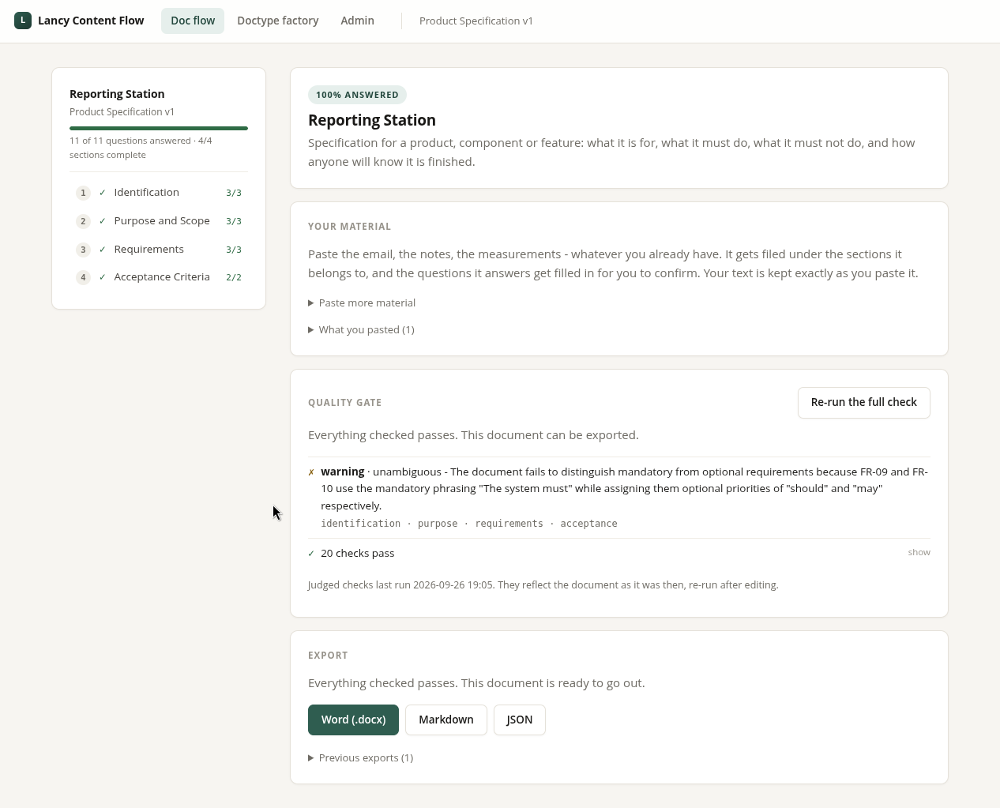

# Lancy Content Flow — structured documents, written with a local LLM

An open-source, self-hosted alternative for filling in structured documents — **8D and 4D problem
solving reports, CAPA write-ups, product specifications, deviation notices** — with a local LLM.
Define the sections and the quality criteria once, paste your raw notes, and accept or decline what
the assistant proposes. Nothing leaves your network.

Runs against any OpenAI-compatible endpoint: **Ollama**, **vLLM**, **LM Studio**, llama.cpp's
server, or a hosted API if you would rather.



*A finished document. The rail tracks how far in you are, the quality gate has run its judged checks,
and export only unlocks once they pass.*

---

A **rule builder** defines document types: sections, the questions a creator must answer,
requirements, quality criteria, and a branded docx template. A **document creator** then works
through a guided flow that drafts what it can from the material supplied and asks about the rest.

Made for quality management and technical writing, where a document has to obey a standard rather
than merely read well: every section carries its own pass/fail checks, and the document cannot be
exported until they pass or someone records, permanently, why they overrode them.

Two invariants shape everything:

- **Content exists only after a human accepted it.** The model produces proposals; acceptance
  appends a revision. `Block` has no value column, so there is no field for a model to write into.
- **The LLM is a worker inside a deterministic frame.** Ordering, gating and composition are
  ordinary Python; the model answers narrow, schema-constrained questions inside it.

Design: [docs/DESIGN.md](docs/DESIGN.md) · Architecture: [docs/ARCHITECTURE.md](docs/ARCHITECTURE.md)

## What this is for

The shipped examples are quality-management documents because that is where the problem bites
hardest: an **8D report** or a **CAPA** has a fixed structure, a customer who will read it closely,
and rules that a well-written paragraph can still break — containment that does not cover every
population of parts implicated in the problem description, a five-why chain that stops at human
error instead of reaching a systemic cause, a claim with no evidence behind it. Those are exactly
the rules a general-purpose chat assistant cannot hold, and exactly what a quality criterion in a
document type states once and then enforces on every report.

Types the model is built for:

- **8D and 4D problem solving reports** — D1 team through D8, dependency-gated so containment
  cannot be written before the problem is described
- **CAPA** — corrective and preventive action records
- **Root cause analysis** — five-why chains, Ishikawa, with the chain checked for depth
- **Deviation and nonconformance notices**
- **Product and requirements specifications** — testability, no weasel words, every requirement
  traced to an acceptance criterion
- **Supplier audit reports**, change requests, and anything else with sections and rules

None of that is hard-coded. A document type is a YAML file or a few minutes in the rule builder;
the 8D is just the largest one shipped.

## Status

**Working end to end.** A document type is defined, a document is created from it, notes are pasted
and sorted into sections, the assistant drafts, a person accepts, the quality gate runs, and a
branded .docx comes out the other side. All of it self-hosted.

Everything on the build order in [ARCHITECTURE §14](docs/ARCHITECTURE.md) is done except the last
two, and both are additive — nothing already built is waiting on them:

| Done | |
|---|---|
| ✓ | Spec model, linter, YAML round-trip |
| ✓ | PostgreSQL schema, Alembic migrations |
| ✓ | Deterministic check engine (6 kinds) |
| ✓ | Section state machine, dependency gating, staleness |
| ✓ | Service layer: publish, create, answer, edit, assess, blame |
| ✓ | Object storage bucket provisioning |
| ✓ | Web UI (FastAPI + Jinja + HTMX), paste-from-spreadsheet tables |
| ✓ | LLM drafting: schema-constrained proposals, gaps, accept/decline, decision log |
| ✓ | Background jobs with live progress — drafting no longer blocks the request |
| ✓ | The full quality gate: judged checks, quote-backed, run as a job |
| ✓ | Export: JSON, Markdown and docx, gated and recorded |
| ✓ | Evidence intake: paste a blob of notes, distributed across the sections, answers proposed from it |
| ✓ | Spec editor for the rule builder: check, publish as a new version, import/export YAML |
| ✓ | A structured builder for the same specs — sections, questions, blocks and checks as forms, for someone who has never read YAML |
| ✓ | Word templates: a starter generated from the spec, branded in Word, bound to a version and carried forward |
| ✓ | Admin view: health of the database, object store and LLM endpoint, background jobs, configuration |
| | Image evidence: upload and captioning |
| | Span-level suggestions and the TipTap editor island |

What is left, in order, is in [BACKLOG.md](docs/BACKLOG.md).

**The milestone that matters:** a 4D report can be driven from empty to a clean quality gate with
hand-written content and no model involved. If that ever stops working, the deterministic core is
broken — and that is far cheaper to discover here than through an LLM.

```
$ lcf walkthrough

initial state
  · header             empty        1 question unanswered
  ⊘ d1_team            blocked      waiting on header
  ⊘ d2_problem         blocked      waiting on header
  ⊘ d3_containment     blocked      waiting on d2_problem
  ⊘ d4_root_cause      blocked      waiting on d2_problem

filling sections in dependency order
  ✓ header             complete
  ✓ d1_team            complete
  ✓ d2_problem         complete
  ✓ d3_containment     complete
  ✓ d4_root_cause      complete

quality gate
  PASS     ✓  14 checks
  PENDING  ·  11 judged checks not run yet

editing a completed section (d2_problem)
  revision 2 appended
  built on this: d3_containment, d4_root_cause. Still valid?
```

## Setup

Requires Python 3.13, a PostgreSQL database, an S3-compatible store (MinIO, versitygw, Ceph), and an
LLM endpoint. All local; nothing leaves the network.

```bash
python3.13 -m venv .venv
.venv/bin/pip install -e ".[dev]"

cp .env.example .env     # fill in database, LLM endpoint and storage
.venv/bin/alembic upgrade head
.venv/bin/lcf buckets
.venv/bin/lcf seed       # publish the example document types
.venv/bin/lcf serve      # then open http://localhost:8090
```

`lcf seed` is what turns an empty database into something you can click through:
it publishes [4d-report.yaml](docs/examples/4d-report.yaml) and
[product-specification.yaml](docs/examples/product-specification.yaml), and prints
where the sample intake material lives. It is idempotent — running it against a
database that already has them reuses the versions rather than making copies — and
it is a command rather than something startup does, so a real installation never
quietly acquires demo document types.

The 8D is not seeded. It is the stress test for the spec model, and 22 KB of it in
a fresh type list is clutter; publish it by hand with
`lcf publish docs/examples/8d-report.yaml` when that is the point.

### Pointing it at a model

Anything that speaks the OpenAI chat-completions API will do. Set two values in `.env`:

```bash
# Ollama
LCF_LLM_BASE_URL=http://localhost:11434/v1
LCF_LLM_MODEL=gemma3:27b

# vLLM
LCF_LLM_BASE_URL=http://your-host:8000/v1
LCF_LLM_MODEL=the-model-id-vllm-serves

# LM Studio
LCF_LLM_BASE_URL=http://localhost:1234/v1
LCF_LLM_MODEL=the-model-id-lm-studio-serves
```

The **Admin** page reaches all three dependencies and says which one is not answering, including
when the endpoint is up but serving a different model than the one configured.

Structured output is required: every model call is schema-constrained and the result is validated
locally, so a model with weak JSON adherence will produce declined proposals rather than bad
content. A 20B-class instruct model is comfortable; smaller ones work for drafting and struggle as
judges.

### Trying the intake

Create a document from a seeded type, then paste one of these into the **Your
material** box and press *Sort it into the sections*:

| Notes | For |
|---|---|
| [4d-report-intake-notes.md](docs/examples/4d-report-intake-notes.md) | 4D Report |
| [product-specification-intake-notes.md](docs/examples/product-specification-intake-notes.md) | Product Specification |

Both are written the way material actually arrives — several sources, in several
registers, with the facts for one section scattered across three of them. Each
contains passages that belong nowhere in its document type, so you see what comes
back unplaced, and each leaves several required things unsaid, so drafting produces
gaps instead of inventing the answer. Nothing is stored that you did not paste: a
mapping is a quotation plus a section key, and the quotation is checked against
your text before the row exists.

## Commands

```bash
lcf lint docs/examples/8d-report.yaml        # validate a spec
lcf roundtrip docs/examples/4d-report.yaml   # YAML survives a round-trip
lcf publish docs/examples/4d-report.yaml     # publish a version
lcf seed                                     # publish the example types
lcf buckets                                  # create missing buckets
lcf walkthrough                              # drive a 4D end to end, no LLM
lcf serve                                    # the web application
```

## Example document types

| Spec | Role |
|---|---|
| [4d-report.yaml](docs/examples/4d-report.yaml) | The demo — and a verified prefix of the 8D |
| [product-specification.yaml](docs/examples/product-specification.yaml) | The generality proof |
| [8d-report.yaml](docs/examples/8d-report.yaml) | The stress test — not seeded |

Sample material to go with them: [`4d-sample-content.yaml`](docs/examples/4d-sample-content.yaml)
is finished content, used by `lcf walkthrough` and the tests; the two
`*-intake-notes.md` files above are raw notes, for the intake feature.

## Licence

MIT — see [LICENSE](LICENSE).

## Tests

```bash
.venv/bin/python -m pytest
```

The deterministic core — spec model, linter, checks, state machine — is tested with dicts and needs
no database, no network and no model. Service tests use the real PostgreSQL from `.env` and skip
if it is unreachable. A boundary test asserts that `spec/` and `engine/` never import a database,
because that purity is what keeps the rest testable.
