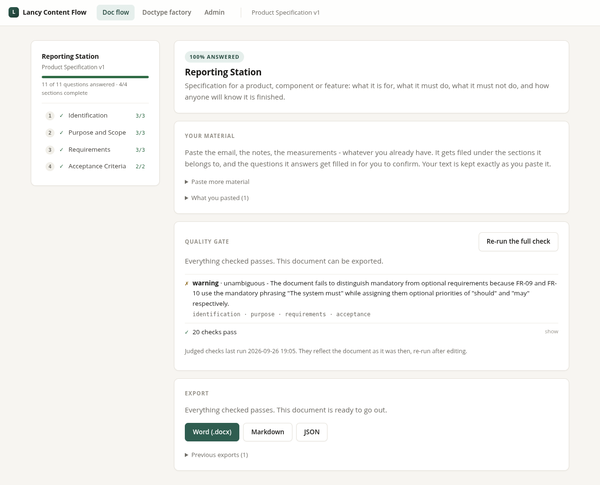

# Lancy Content Flow - create structured documents, assisted by a local LLM

An open-source, self-hosted solution for filling in structured documents assisted by a local LLM: **8D and 4D problem
solving reports, product specifications, deviation notices**.
Define the sections and the quality criteria once, paste your raw notes, and accept or decline what
the assistant proposes. Nothing leaves your network.

Runs against any OpenAI-compatible endpoint: **Ollama**, **vLLM**, **LM Studio**, llama.cpp's
server, or a hosted API if you would rather.



*A finished document. The rail tracks how far in you are, the quality gate has run its judged checks,
and export only unlocks once they pass.*

---

A **rule builder** defines document types: sections, the questions a creator must answer,
requirements, quality criteria, and a branded docx template. A **document creator** then works
through a guided flow that drafts what it can from the material supplied and asks about the rest.

An **evidence desk** handles what comes before that. A complaint does not arrive as a document; it
arrives as a pile — the customer's form, a measurement report, photographs, a mail thread four
forwards deep, every customer's template different. Drop the lot in, write down once what has to come
out of it (*which batches? what was measured? what is their complaint number?*), and the desk finds
candidates and shows the passage behind each one for you to accept or dismiss. Patterns cost no model
calls at all, and the questions save as a set, so the next complaint from the same customer starts
pre-wired.

Made for quality management and technical writing, where a document has to obey a standard rather
than merely read well: every section carries its own pass/fail checks, and the document cannot be
exported until they pass or someone records, permanently, why they overrode them.

Two invariants shape everything:

- **Content exists only after a human accepted it.** The model produces proposals; acceptance
  appends a revision. `Block` has no value column, so there is no field for a model to write into.
- **The LLM is a worker inside a deterministic frame.** Ordering, gating and composition are
  ordinary Python; the model answers narrow, schema-constrained questions inside it.

Design: [docs/DESIGN.md](docs/DESIGN.md) · Architecture: [docs/ARCHITECTURE.md](docs/ARCHITECTURE.md) ·
Evidence desk: [docs/EVIDENCE-DESK.md](docs/EVIDENCE-DESK.md) ·
Using the evidence desk: [docs/EVIDENCE-DESK-GUIDE.md](docs/EVIDENCE-DESK-GUIDE.md)

## What this is for

The shipped examples are quality-management documents because that is where the problem materializes: an **8D report** or a **requirement document** has a fixed structure, a customer who will read it closely,
and rules that a well-written paragraph can still break — containment that does not cover every
population of parts implicated in the problem description, a five-why chain that stops at human
error instead of reaching a systemic cause, a claim with no evidence behind it. Those are exactly
the rules a general-purpose chat assistant cannot hold, and exactly what a quality criterion in a
document type states once and then enforces on every report.

Types the model is built for:

- **8D and 4D problem solving reports** — D1 team through D8, dependency-gated so containment
  cannot be written before the problem is described
- **CAPA** — corrective and preventive action records
- **Root cause analysis** — five-why chains, Ishikawa, with the chain checked for depth
- **Deviation and nonconformance notices**
- **Product and requirements specifications** — testability, no weasel words, every requirement
  traced to an acceptance criterion
- **Supplier audit reports**, change requests, and anything else with sections and rules

None of that is hard-coded. A document type is a YAML file or a few minutes in the rule builder;
the 8D is just the largest one shipped.

## Status

**Working end to end.** A document type is defined, a document is created from it, notes are pasted
and sorted into sections, the assistant drafts, a person accepts, the quality gate runs, and a
branded .docx comes out the other side. Admin section for setup and usage insights. Currently no user management and role concept. 

Everything on the build order in [ARCHITECTURE §14](docs/ARCHITECTURE.md) is done except the last
two, and both are additive — nothing already built is waiting on them:

| Done | |
|---|---|
| ✓ | Spec model, linter, YAML round-trip |
| ✓ | Schema and Alembic migrations, PostgreSQL or SQLite |
| ✓ | Deterministic check engine (6 kinds) |
| ✓ | Section state machine, dependency gating, staleness |
| ✓ | Service layer: publish, create, answer, edit, assess, blame |
| ✓ | Storage on the local disk by default, S3-compatible when you want it |
| ✓ | Web UI (FastAPI + Jinja + HTMX), paste-from-spreadsheet tables |
| ✓ | LLM drafting: schema-constrained proposals, gaps, accept/decline, decision log |
| ✓ | Background jobs with live progress — drafting no longer blocks the request |
| ✓ | The full quality gate: judged checks, quote-backed, run as a job |
| ✓ | Export: JSON, Markdown and docx, gated and recorded |
| ✓ | Evidence intake: paste a blob of notes, distributed across the sections, answers proposed from it |
| ✓ | **The evidence desk**: drop in the pile of files a complaint actually arrives as, say what has to come out of it, and accept the candidates it finds |
| ✓ | Spec editor for the rule builder: check, publish as a new version, import/export YAML |
| ✓ | A structured builder for the same specs — sections, questions, blocks and checks as forms, for someone who has never read YAML |
| ✓ | Word templates: a starter generated from the spec, branded in Word, bound to a version and carried forward |
| ✓ | Admin view: health of the database, store and LLM endpoint, background jobs, configuration |
| ✓ | Guided first-run setup: tests each dependency before saving, runs the migrations |
| | Accepted images reaching an `image_ref` block in a document |
| | Span-level suggestions and the TipTap editor island |

What is left, in order, is in [BACKLOG.md](docs/BACKLOG.md).


```
$ lcf walkthrough

initial state
  · header             empty        1 question unanswered
  ⊘ d1_team            blocked      waiting on header
  ⊘ d2_problem         blocked      waiting on header
  ⊘ d3_containment     blocked      waiting on d2_problem
  ⊘ d4_root_cause      blocked      waiting on d2_problem

filling sections in dependency order
  ✓ header             complete
  ✓ d1_team            complete
  ✓ d2_problem         complete
  ✓ d3_containment     complete
  ✓ d4_root_cause      complete

quality gate
  PASS     ✓  14 checks
  PENDING  ·  11 judged checks not run yet

editing a completed section (d2_problem)
  revision 2 appended
  built on this: d3_containment, d4_root_cause. Still valid?
```

## Setup

Requires Python 3.13, a database, and an LLM endpoint. The database is PostgreSQL, or SQLite if you
would rather have one file and no server — the setup page makes you pick, and an installation that
has not picked is not configured. Files are kept on the local disk unless you point it at an
S3-compatible store. All local; nothing leaves the network.

```bash
uv sync --extra dev     # exact versions from uv.lock
.venv/bin/lcf serve     # then open http://localhost:8090
```

`uv.lock` pins all 59 packages, so a deployment installs what was tested rather than whatever PyPI
served that morning. Without [uv](https://docs.astral.sh/uv/), `python3.13 -m venv .venv` and
`.venv/bin/pip install -e ".[dev]"` still work — you just resolve your own versions.

That is the whole of it. An installation with no configuration serves a **setup page** instead of
the app: it asks which database you want and where it is, tests the connection before saving
anything, and for PostgreSQL hands you the `psql` or `docker run` command to create it — generated
from the values you typed, so the command and the configuration cannot disagree. SQLite needs none
of that; it creates the file. Then it runs the migrations, checks storage, and tests the model
endpoint.

PostgreSQL is the deployment this is built for and keeps the better of anything the two dialects do
differently; SQLite takes the lesser. The whole of that difference today is the resolution of one
timestamp — milliseconds rather than microseconds — and the same test suite passes on both. What
SQLite gives up in exchange for having no server is concurrent writers: it takes one lock for the
whole file, so background jobs that would overlap on PostgreSQL queue instead.

Setup is reachable from anywhere the app is, because this normally runs on a headless server and the
administrator is always remote. It has **no login**: what it may write is bounded by an allowlist of
configuration keys rather than by who is asking, and it will not repoint a database that is already
working. Run it on a trusted network. Accounts and roles are the next thing it needs.

<details>
<summary>Prefer to do it by hand?</summary>

```bash
cp .env.example .env     # fill in database, LLM endpoint and storage
.venv/bin/alembic upgrade head
.venv/bin/lcf buckets    # only needed for S3; the local disk makes its own
.venv/bin/lcf seed       # publish the example document types
.venv/bin/lcf serve
```

Configuration is read from `.env` beside `pyproject.toml` in a source checkout, or
`~/.config/lcf/.env` when installed. `LCF_ENV_FILE` overrides both.
</details>

`lcf seed` is what turns an empty database into something you can click through:
it publishes [4d-report.yaml](docs/examples/4d-report.yaml) and
[product-specification.yaml](docs/examples/product-specification.yaml), and prints
where the sample intake material lives. It is idempotent — running it against a
database that already has them reuses the versions rather than making copies — and
it is a command rather than something startup does, so a real installation never
quietly acquires demo document types.

The 8D is not seeded. It is the stress test for the spec model, and 22 KB of it in
a fresh type list is clutter; publish it by hand with
`lcf publish docs/examples/8d-report.yaml` when that is the point.

### Pointing it at a model

Anything that speaks the OpenAI chat-completions API will do. Set two values in `.env`:

```bash
# Ollama
LCF_LLM_BASE_URL=http://localhost:11434/v1
LCF_LLM_MODEL=gemma3:27b

# vLLM
LCF_LLM_BASE_URL=http://your-host:8000/v1
LCF_LLM_MODEL=the-model-id-vllm-serves

# LM Studio
LCF_LLM_BASE_URL=http://localhost:1234/v1
LCF_LLM_MODEL=the-model-id-lm-studio-serves
```

The **Admin** page reaches all three dependencies and says which one is not answering, including
when the endpoint is up but serving a different model than the one configured.

Structured output is required: every model call is schema-constrained and the result is validated
locally, so a model with weak JSON adherence will produce declined proposals rather than bad
content. A 20B-class instruct model is comfortable; smaller ones work for drafting and struggle as
judges.

#### If you serve with vLLM, turn off free whitespace

Add this to the `vllm serve` command:

```bash
--structured-outputs-config '{"backend":"xgrammar","disable_any_whitespace":true}'
```

Without it, xgrammar compiles each schema with an unbounded whitespace self-loop at every JSON
value position, and a model that puts weight on a newline there takes it — emitting thousands of
newlines mid-object and running to the token ceiling without ever closing it. Measured on a
gemma-4-26b deployment: every drafting call, a 10,000-character run of whitespace, 98 seconds, and
no usable answer.

The application survives this on its own — it aborts such a generation, retries, and recovers — so
the symptom is a doubled cost and `(after a retry)` on most assistant rows in the **Admin** log
rather than a failure. The flag removes the cause. It cannot be set per request: passed in
`extra_body` it is either rejected or silently ignored, so it has to go on the server.

### Trying the intake

Create a document from a seeded type, then paste one of these into the **Your
material** box and press *Sort it into the sections*:

| Notes | For |
|---|---|
| [4d-report-intake-notes.md](docs/examples/4d-report-intake-notes.md) | 4D Report |
| [product-specification-intake-notes.md](docs/examples/product-specification-intake-notes.md) | Product Specification |

Both are written the way material actually arrives — several sources, in several
registers, with the facts for one section scattered across three of them. Each
contains passages that belong nowhere in its document type, so you see what comes
back unplaced, and each leaves several required things unsaid, so drafting produces
gaps instead of inventing the answer. Nothing is stored that you did not paste: a
mapping is a quotation plus a section key, and the quotation is checked against
your text before the row exists.

### Trying the evidence desk

**Evidence desk → Open a case**, then drop files on it — a PDF, a Word file, an
`.eml` thread, a photograph — or paste text. Each is read into passages that keep
their page number and, for mail, who wrote them.

Then say what has to come out of the pile. For *"what is the customer's complaint
number?"*, paste one or two real examples and press **Write me a pattern**: the
assistant writes a regular expression, it is checked against your examples, and
it is run over what you have already dropped in — so you see *14 matches across 3
files*, or none, before you keep it. A pattern costs no assistant calls when the
search runs.

For something with no fixed shape, narrow it instead: give a word the material is
likely to use and only the passages mentioning it are read. Matching is stemmed
per language, so `Toleranz` finds `Toleranzen`, and **Suggest more words** offers
terms in the language your files are actually in.

Press **Search the pile**. It tells you what it will cost before it spends it.
Candidates come back grouped by how certainly they were found — *found exactly*,
*found near your keywords*, *read from the text* — one card per distinct value
with every place it appeared, and each card will tell you the route it took if you
ask. Accept what is right, dismiss what is not, and run again after dropping more
files in: accepted values stay, dismissed ones never come back.

What you accept comes out as JSON, or as Markdown that pastes straight into a
document's intake box with all its quotations.

## Commands

```bash
lcf lint docs/examples/8d-report.yaml        # validate a spec
lcf roundtrip docs/examples/4d-report.yaml   # YAML survives a round-trip
lcf publish docs/examples/4d-report.yaml     # publish a version
lcf seed                                     # publish the example types
lcf buckets                                  # create missing buckets
lcf walkthrough                              # drive a 4D end to end, no LLM
lcf serve                                    # the web application
```

## Example document types

| Spec | Role |
|---|---|
| [4d-report.yaml](docs/examples/4d-report.yaml) | The demo — and a verified prefix of the 8D |
| [product-specification.yaml](docs/examples/product-specification.yaml) | The generality proof |
| [8d-report.yaml](docs/examples/8d-report.yaml) | The stress test — not seeded |

Sample material to go with them: [`4d-sample-content.yaml`](docs/examples/4d-sample-content.yaml)
is finished content, used by `lcf walkthrough` and the tests; the two
`*-intake-notes.md` files above are raw notes, for the intake feature.

## Licence

MIT — see [LICENSE](LICENSE).

## Tests

```bash
.venv/bin/python -m pytest
```

The deterministic core — spec model, linter, checks, state machine, and the evidence desk's parsers,
chunker and ranker — is tested with dicts and bytestrings, and needs no database, no network and no
model. The parser fixtures are **generated in Python** rather than committed, including a hand-built
PDF, so what each test asserts against is known content rather than a binary nobody can read in a
diff.

Service tests use the real database from `.env` and skip if it is unreachable. Pointing `LCF_DB_URL`
at a scratch SQLite file runs them with nothing to set up, and is also how the SQLite backend is
tested: the suite is the same either way. A boundary test asserts that `spec/`, `engine/` and
`ingest/` never import a database, because that purity is what keeps the rest testable.
