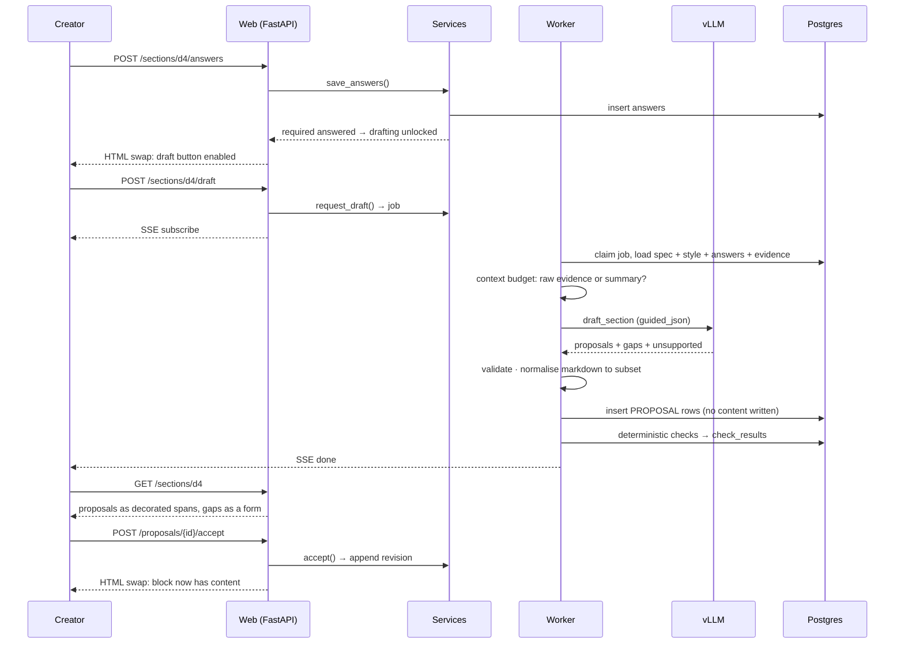

# Lancy Content Flow — Architecture

> Status: **draft v0.2** · 2026-09-20 · companion: [DESIGN.md](DESIGN.md)

## 1. Shape: one service

```
┌────────────────────────────────────────────────────────────┐
│  lcf   (single Python service)                             │
│                                                            │
│   FastAPI                                                  │
│    ├── Jinja2 templates + HTMX        ← the UI             │
│    │     └── JS islands: editor, suggestion overlay        │
│    ├── HTTP routes (thin)                                  │
│    └── service layer  ← the real contract                  │
│          spec · engine · llm · evidence · render · jobs    │
└───────────┬──────────────┬──────────────┬──────────────────┘
            │              │              │
   OpenAI-compatible    asyncpg      S3 (boto3)
            │              │              │
            ▼              ▼              ▼
   ┌────────────────┐  ┌──────────────────────────┐
   │  LLM host      │  │  data host               │
   │                │  │                          │
   │  vLLM          │  │  PostgreSQL   versitygw  │
   │  multimodal    │  │               (S3 API)   │
   │  (image budget │  │                          │
   │   per call)    │  │                          │
   └────────────────┘  └──────────────────────────┘
```

Everything runs on the local network. No cloud dependency, no egress.

### Why not a split frontend and backend

The guided flow is **server-held state**: which section you're on, what's answered, what's
proposed, what's stale. A SPA would mirror that state in the browser and the two would drift —
and every flow rule would end up expressed twice. HTMX suits this exactly: accepting a proposal is
a `POST` that swaps in new HTML, and the server stays the only authority on what the document is.

JS is used where it genuinely earns its place, and nowhere else — the markdown editor and its
suggestion overlay (§6).

### The service layer is the contract, not HTTP

Capabilities are **plain Python functions** — typed, transactional, fully testable without a web
server. HTTP routes are a thin skin over them; so is anything else we add later.

This deliberately replaces v0.1's "everything must be an API call" rule, which conflated two
claims. *A document can be produced by one API call* was never true — the flow is stateful and
iterative by nature, and pretending otherwise would have distorted the design. *Every capability is
reachable programmatically* is worth keeping, and a service layer gives it to us more cheaply than
an HTTP-first mandate did.

## 2. Stack

| Concern | Choice | Notes |
|---|---|---|
| Language | Python 3.13 | |
| Web | FastAPI + uvicorn | Routes, templates and JSON from one app |
| Templates | Jinja2 | Server-rendered HTML is the UI |
| Interactivity | HTMX 2 + Alpine.js | Swaps and local state; no build step needed |
| Editor island | TipTap (ProseMirror), vanilla | Bundled with esbuild — the only JS build |
| CSS | Tailwind CLI (standalone binary) | No Node project required |
| Validation | Pydantic v2 | Also the source of every LLM output schema |
| Settings | pydantic-settings | `.env` driven |
| ORM | SQLAlchemy 2 (async) + asyncpg | |
| Migrations | Alembic | From commit 1 |
| LLM client | `openai` SDK → vLLM | OpenAI-compatible, guided decoding |
| Markdown | markdown-it-py | Parse, restrict, normalise (DESIGN §9) |
| docx | docxtpl + python-docx | Jinja tags in a real Word template |
| Object storage | boto3 → versitygw | |
| Logging | loguru | |
| Lint / test | ruff, pytest | |

Full library shortlist with rationale: [§12](#12-library-shortlist).

### Deliberately absent

| Not using | Instead | Why |
|---|---|---|
| A JS framework | Server-rendered HTML + islands | The state lives on the server; mirroring it is the cost, not the feature |
| Redis / Celery | Postgres job table | One less service; we need job rows for progress and audit anyway |
| A vector DB | Context + rolling summaries | Retrieval is a different product |
| A workflow engine | State machine over `depends_on` | The graph is small and the semantics are ours |
| A rules DSL | Closed vocabulary of check kinds | A DSL is a language to learn, document and debug |
| A git library | YAML export/import | Version control specs yourself; no credentials, no merge UI |

## 3. Repository layout

```
lcf/
├── src/lcf/
│   ├── main.py             # FastAPI app assembly
│   ├── core/               # config, db session, logging
│   ├── models/             # SQLAlchemy
│   ├── schemas/            # Pydantic
│   ├── services/           # THE CONTRACT — plain functions, no HTTP
│   │   ├── doc_types.py    #   publish, validate, import/export
│   │   ├── documents.py    #   create, intake, section state
│   │   ├── proposals.py    #   propose, accept, reject, revise
│   │   └── assessment.py   #   run checks, gate, report
│   ├── spec/               # spec model, YAML round-trip, linter
│   ├── engine/             # state machine, staleness, composition
│   │   └── checks/         #   deterministic/  llm/
│   ├── llm/                # provider, typed calls, prompts/, style resolution
│   ├── evidence/           # intake, mapping, captioning
│   ├── markdown/           # subset definition, AST normalisation
│   ├── render/             # json, markdown, docx + template linter
│   ├── jobs/               # queue, worker, SSE
│   └── web/                # routes, templates/, static/
├── assets/                 # editor island source → built into web/static
├── alembic/
├── tests/
├── docs/
│   ├── DESIGN.md · ARCHITECTURE.md
│   └── examples/*.yaml
├── .env.example
└── docker-compose.yml
```

`spec/`, `engine/` and `render/` **know nothing of each other beyond data**. `engine/` never
imports `render/`; `render/` never imports `engine/`. That boundary is the code-level expression of
[DESIGN §4](DESIGN.md#4-three-artifacts-kept-apart) and is worth a test that asserts it.

## 4. Data model

```
doc_type ──┬─< doc_type_version ─┐         (immutable, pinned by document)
           │                    │
           └─< exemplar         │         section_key, block_key, value,
                                │         harvested_from (revision id)
document ───────────────────────┘
   ├──< evidence_item        kind, uri, text, caption, meta
   ├──< section              key, status
   │      ├──< answer        question_key, value, source
   │      └──< block         key, kind
   │             ├──< revision    seq, value, author, proposal_id     (append-only)
   │             └──< proposal    anchor, proposed_value, rationale,
   │                              based_on, confidence, status
   ├──< assessment ──< check_result
   ├──< llm_call             call_type, prompt, response, tokens, ms
   ├──< job
   └──< export               format, uri
```

### Notable decisions

**Spec stored as one JSONB document, validated by Pydantic on read.** A spec version is authored,
validated and published as a unit. Shredding it across a dozen tables would buy query flexibility
we don't need while making versioning and diffing painful.

**Content stored as rows.** The opposite choice for the opposite reason: blocks are written
constantly and individually, and each needs its own history.

**`revision` is append-only and is the content.** A block has no `value` column — its value is its
latest revision. This is [invariant I](DESIGN.md#i-content-exists-only-after-a-human-accepted-it)
expressed in the schema: there is no field for an LLM to write into. Blame is computed by diffing
consecutive revisions, not stored per character.

**`proposal` rows survive their outcome.** Accepted, edited or rejected, they stay. What the model
suggested and what the human did about it is the audit trail.

**`llm_call` logs every call** — type, resolved prompt, resolved style, response, tokens, duration.
"Why did it write it that way" must be answerable weeks later.

**Versions are immutable; documents pin one.** Publishing freezes a version. Without this, editing
a rule silently invalidates every document in progress.

## 5. LLM integration

### 5.1 Structured output

vLLM supports **guided decoding** (xgrammar/outlines), so a JSON schema is a grammar-level
guarantee rather than a hope. Every structured call:

1. Defines its response as a Pydantic model.
2. Passes the schema as `response_format`, in the form verified below.
3. Validates the result against the model anyway.
4. Retries once with the validation error appended on failure.

**Verified against the running gateway** (2026-09-20), because the parameter form matters and the
wrong one fails silently:

| Form | Result |
|---|---|
| `response_format: {"type": "json_schema", "json_schema": {name, schema, strict: true}}` | **Works.** Schema held exactly |
| `response_format: {"type": "json_object"}` | Valid JSON, but arbitrary shape — not usable |
| `guided_json` at the top level | **Silently ignored.** Returns plain prose, no error |

The last row is why steps 3–4 are not redundant. An endpoint that ignores a constraint returns a
`200` with unusable content, and without local validation that becomes corruption rather than a
logged retry. Never trust the constraint alone.

**Two further constraints the schema itself must carry**, both learned the hard way:

- **Every array needs `maxItems`.** A constrained array has no reason to stop, so the model
  generates rows until it exhausts the context — minutes of work for a table wanting four entries.
  Spec `min_rows`/`max_rows` supply the real bounds; a ceiling covers the rest.
- **Guard against whitespace padding.** A JSON grammar permits unlimited whitespace between
  tokens, and this model routinely exploits it: generations pad thousands of newlines *mid-object*
  and run to the token ceiling without ever closing. Measured on all three calls of a typical
  section.

Because the padding happens inside the object, no amount of token budget fixes it — the object
never closes. So requests are **streamed**, with two aborts:

| Guard | Effect |
|---|---|
| Stop when brace depth returns to zero | The object is complete; everything after is padding |
| Abort on a whitespace run outside a string | The pathology has started and will not terminate |

An aborted call is retried immediately with a compacted echo of what came back. The retry succeeds
in practice, and catching the pathology early is what makes the difference between a section
drafting in **16 seconds and in nearly three minutes** — measured, same section, same model.

Independent blocks are drafted **concurrently** under `LCF_LLM_CONCURRENCY`, so a section costs
its slowest block rather than the sum of them.

### 5.2 Call taxonomy

Per [DESIGN §6.3](DESIGN.md#64-narrow-calls-flexible-context), every call answers one question and
returns one schema. The complete set:

| Call | Scope | Returns |
|---|---|---|
| `map_evidence_to_sections` | intake blob + section list | evidence → section assignments, confidence |
| `caption_images` | ≤ image budget | caption per image |
| `prefill_answers` | one section's questions + mapped evidence | proposed answers, or "ask the user" |
| `draft_section` | one section: spec, style, answers, evidence | block proposals + open gaps + unsupported claims |
| `suggest_span` | one span + instruction | proposed replacement + rationale |
| `evaluate_check` | one LLM check + referenced blocks | pass/fail + reason + confidence |
| `evaluate_consistency` | one criterion across 2–n sections | pass/fail + reason + evidence refs |
| `summarize` | one section or the evidence pool | compact standing summary for later context |

Eight call types. Each has a fixed Pydantic response model, a prompt template in `llm/prompts/`,
and test fixtures. **A ninth requires a design decision** — the pressure to add "just one more
general-purpose call" is exactly what this table exists to resist.

Composition lives in `engine/`, in ordinary Python.

### 5.3 Context budget

Output scope is fixed and narrow; input context is a tactical decision per call:

1. Always: section spec, resolved style, confirmed answers, current content.
2. If it fits: raw mapped evidence.
3. If it doesn't: the `summarize` output for that evidence instead.
4. Images: only for `uses_images` sections, within the per-call budget
   (`LCF_LLM_MAX_IMAGES_PER_CALL` — config, because it is a model property that will change).

The budget check is a token count against a configured window, not a guess.

### 5.4 Prompt assembly

Prompts are **composed, never authored by users** ([DESIGN §5.8](DESIGN.md#58-instructing-the-model)).
`llm/prompts/` holds the task frames and the system style default, versioned with the code. A
`draft_section` prompt is assembled in fixed order:

| # | Part | Source |
|---|---|---|
| 1 | Task frame | `llm/prompts/draft_section.md` — ours, fixed |
| 2 | Resolved style | system default → doc type → section |
| 3 | Section spec | title, description, guidance, block definitions |
| 4 | Requirement targets | **rendered from the section's own checks** |
| 5 | Exemplars | fact-fenced, if the doc type has any |
| 6 | Runtime data | confirmed answers, mapped evidence, current content |
| 7 | Output schema | Pydantic → `guided_json` |
| 8 | The never-invent rule | composed **last**, so nothing above softens it |

Part 4 is the one that costs nothing and does the most: a `mentions` requirement is rendered as an
explicit target, so the model is told what it will be graded on by the very check that will grade
it. There is no second place to keep those instructions in sync.

Part 8 is not overridable:

> Never invent facts. If a requirement cannot be satisfied from the supplied evidence, emit a gap,
> not a draft.

Enforced by ordering and covered by a test that composes a hostile doc-type style and asserts the
rule still terminates the prompt.

The assembled prompt is **stored on the `llm_call` row** and viewable per section in the spec
editor. The rule builder cannot edit it — but they cannot debug guidance they cannot see.

#### Exemplar leakage

Exemplars carry facts from a different case. A proposal sharing a distinctive n-gram with an
exemplar it was shown is flagged for review rather than presented as a clean draft — cheap to
compute, and it catches the specific way few-shot prompting fails.

## 6. The editor island

The only substantial JavaScript. A TipTap (ProseMirror) instance per prose block, restricted to the
markdown subset from [DESIGN §9](DESIGN.md#9-markdown-integrity) by its schema — the editor is
structurally incapable of producing a heading or a table.

| Concern | Mechanism |
|---|---|
| Markdown ↔ document | `tiptap-markdown`, serialising to the same subset the server enforces |
| Suggestion spans | ProseMirror **decorations** — marked ranges with a hover card |
| Accept / reject | HTMX `POST` to `/proposals/{id}/accept`; server returns the new block HTML |
| Edit in place | Accept, then edit normally; the revision records `llm_accepted_edited` |
| Blame view | Decorations again, coloured by revision, from a server-computed diff |
| Table paste | Clipboard TSV/CSV parsed client-side, column mapping confirmed server-side and remembered per doc type ([DESIGN §14.3](DESIGN.md#143-tables-are-pasted-not-typed)) |
| Decision log | Server-rendered collapsed strip; no JS beyond the disclosure toggle |

Decorations are the reason for TipTap: they mark ranges *without* altering the document, which is
precisely a suggestion — visible, hoverable, and not yet content. That maps onto invariant I with
no impedance mismatch at all.

Everything else in the UI is plain server-rendered HTML with HTMX swaps. Alpine handles local
toggles that are not worth a round trip.

## 7. Jobs and streaming

LLM work is slow enough to need progress and cancellation, not slow enough to need Celery.

- A `job` row carries `status`, `step`/`total`, `message`, `result`, `error`.
- v1 runs work **in-process** as an asyncio task started at enqueue. Because the state is a row
  rather than memory, splitting it into its own process later is a deployment change, not a
  rewrite — that is when `SELECT … FOR UPDATE SKIP LOCKED` and `LISTEN/NOTIFY` become worth adding.
- Each job opens **its own session**. It outlives the request that queued it and must not borrow
  that request's transaction.
- Progress reaches the browser by **polling**, once a second, in server-rendered HTML. The card
  asks for itself again until the job finishes, then returns an element that loads the finished
  region into place.

**This replaces SSE, which was the original decision and failed in practice.** `htmx-ext-sse`
wants the element carrying `hx-trigger="sse:done"` to be a *descendant* of the one carrying
`sse-connect`; with both on one element the listener is registered before the source exists. The
job completed correctly and the page sat on "Working…" indefinitely — and nothing on the server
said anything was wrong.

Two reasons polling is the better call here and not merely the working one:

| | |
|---|---|
| **Verifiable** | The whole chain can be walked with `curl` — POST, each poll, the completion element, the final region. The SSE version could only be tested by opening a browser, which is how it shipped broken. |
| **Cheap at this scale** | A 15-second job costs ~15 requests against a primary key. That is nothing, and it removes a vendored extension and a dependency. |

A stuck spinner over finished work is the worst failure mode this feature has: it tells the user
the opposite of the truth. Worth a duller mechanism.

What this buys, measured: the draft request returns in **54 ms** instead of blocking for the
length of the generation. The work continues if the browser goes away, and reopening the section
rejoins the running job rather than offering a second one.

Independent calls within a job run concurrently under a semaphore sized to what the LLM host
tolerates. The final assessment is naturally parallel across checks.

## 8. Object storage

| Bucket | Holds | Lifecycle |
|---|---|---|
| `lcf-uploads` | Images and any uploaded files | Deleted with the document |
| `lcf-templates` | docx templates, logos, fonts | Versioned with the doc type |
| `lcf-exports` | Rendered docx | Retained |

Postgres holds metadata and content; S3 holds bytes. Downloads are presigned URLs, so the app never
proxies file payloads.

## 9. Route surface

Server-rendered pages return HTML; the same service functions are exposed as JSON where scripting
is plausible. Both are thin.

```
# Rule builder
GET   /doc-types                          list
GET   /doc-types/{id}/versions/{v}        spec editor
POST  /doc-types/{id}/versions            publish  (validate + lint template)
POST  /doc-types/import                   YAML in
GET   /doc-types/{id}/versions/{v}.yaml   YAML out
PUT   /doc-types/{id}/versions/{v}/template

# Creator
POST  /documents                          {doc_type_id, version}
GET   /documents/{id}                     flow overview: section states, open work
POST  /documents/{id}/intake              paste text + images   → job
GET   /documents/{id}/sections/{key}      the working surface
POST  /documents/{id}/sections/{key}/answers
POST  /documents/{id}/sections/{key}/draft                      → job
POST  /proposals/{id}/accept              → new block HTML
POST  /proposals/{id}/reject
PATCH /blocks/{id}                        direct user edit → revision
POST  /documents/{id}/sections/{key}/complete
POST  /documents/{id}/assess                                    → job
GET   /documents/{id}/blame
POST  /documents/{id}/export/{format}     json | markdown | docx

# Jobs
GET   /jobs/{id}                          GET /jobs/{id}/events   (SSE)
```

`GET /documents/{id}` is deliberately rich — one request renders everything the flow needs, so the
page never assembles truth from five endpoints.

## 10. Sequence — drafting one section



Note where content appears: **only** at the final accept.

## 11. Configuration

All settings come from the environment via `pydantic-settings`. See
[`.env.example`](../.env.example) for the full set with neutral placeholders; `.env` holds the real
values and is git-ignored.

Values that are not credentials but *model properties* — notably
`LCF_LLM_MAX_IMAGES_PER_CALL` and the context window — are configuration rather than constants,
because they change when the model does and the batching logic must read them rather than assume.

## 12. Library shortlist

Nothing here should be written by hand if a proven library exists.

### Core

| Need | Library | Why this one |
|---|---|---|
| Spec validation | **Pydantic v2** | One model definition serves validation, OpenAPI and LLM schemas |
| YAML round-trip | **ruamel.yaml** | Preserves comments and ordering — essential if specs are git-tracked |
| Spec version diff | **DeepDiff** | Structural diff of two spec documents, ready to render |
| Dependency order | **`graphlib.TopologicalSorter`** | Stdlib. Ordering *and* cycle detection for `depends_on`, free |
| Settings | **pydantic-settings** | `.env` → typed config |

### Content

| Need | Library | Why this one |
|---|---|---|
| Markdown parse/restrict | **markdown-it-py** | CommonMark with a token stream — whitelisting the subset is a filter, not a regex |
| Markdown extensions | **mdit-py-plugins** | Only if we ever need more than the subset |
| HTML sanitising | **nh3** | Rust `ammonia` bindings; `bleach` is deprecated |
| Span diff for blame | **diff-match-patch** | Character-level diffs designed for exactly this; stdlib `difflib` if line-level suffices |

### Editor

| Need | Library | Why this one |
|---|---|---|
| Rich text | **TipTap v2** (vanilla, no React) | ProseMirror with a sane API; decorations are first-class |
| Markdown bridge | **tiptap-markdown** | Serialise to the same subset the server enforces |
| Change tracking | **prosemirror-changeset** | Only if accept/reject needs to survive concurrent edits |
| Bundling | **esbuild** | One command, no framework, no config file |

### LLM

| Need | Library | Why this one |
|---|---|---|
| Client | **openai** SDK | vLLM speaks it; `extra_body` carries `guided_json` |
| Structured output | Pydantic + `guided_json` | **instructor** is an option but adds a layer over something vLLM already guarantees |
| Token counting | **tiktoken** or the model's tokenizer | Needed for a real context budget, not a guessed one |
| Images | **Pillow** | Resize and normalise before vision calls; keeps payloads sane |

### Output

| Need | Library | Why this one |
|---|---|---|
| docx from template | **docxtpl** | Jinja in a real Word file; designers keep control of branding |
| docx internals | **python-docx** | Underlies docxtpl; direct use for image placement and table styling |
| Rich markdown → docx | **pypandoc** + `reference.docx` | Only if docxtpl's RichText proves too limited for prose formatting |

### Infrastructure

| Need | Library | Why this one |
|---|---|---|
| Job queue | **procrastinate** | Postgres-backed, mature — the alternative is ~200 lines of `SKIP LOCKED` we'd own |
| S3 | **boto3** | versitygw patterns already exist next door |
| Migrations | **Alembic** | |
| SSE | **sse-starlette** + `htmx-ext-sse` | Server-side progress rendering, no custom JS |
| Test async | **pytest-asyncio** | |
| LLM fixtures | **respx** | Record real vLLM responses, replay them in CI |

### Later, if ever

| Need | Library | When |
|---|---|---|
| PDF/DOCX import | **docling**, **markitdown** | Only when file import stops being optional (DESIGN §6.1) |
| Git sync | **dulwich** | Pure-Python, no libgit2 — if export/import ever proves insufficient |

## 13. Testing

| Layer | Approach |
|---|---|
| Spec model | YAML → model → YAML round-trip; linter rejects malformed specs |
| Deterministic checks | Pure functions, table-driven, no LLM, no DB |
| State machine | Readiness and staleness propagation over the example specs |
| Markdown subset | Property test: normalise(arbitrary markdown) ∈ subset |
| Services | Real Postgres, no HTTP |
| Composition | Recorded LLM responses via respx; assert merge logic and proposal creation |
| Live LLM | Small suite against the real host, run on demand, not in CI |
| Rendering | Render a known document; assert docx contains expected text and images |
| Boundaries | Assert `render/` does not import `engine/`, and vice versa |

The parts that must be right — deterministic checks, the state machine, composition — are all
testable without a model. That is by design. If the flow can only be tested by talking to an LLM,
the architecture has failed.

## 14. Build order

1. Spec model, linter, YAML round-trip. No web, no DB.
2. Postgres schema + Alembic. Documents, sections, blocks, revisions.
3. Deterministic checks, state machine, staleness. **Walk a 4D end to end with typed content and
   no LLM.**
4. Server-rendered flow UI with HTMX: sections, questions, plain editing.
5. LLM provider, `draft_section`, the proposal model. Block-level accept/reject first.
6. The editor island: TipTap, span proposals, decorations, blame.
7. Intake: paste + `map_evidence_to_sections`; images and captioning.
8. Assessment: LLM checks, quality criteria, gate report.
9. Export: JSON, then Markdown, then docx with template linting.
10. Spec editor UI for the rule builder.

Step 3 is the checkpoint that matters. If a 4D cannot be walked from start to finish with
hand-typed content and no model involved, something was built in the wrong order — and every later
step will be debugged through an LLM that makes everything non-deterministic.
