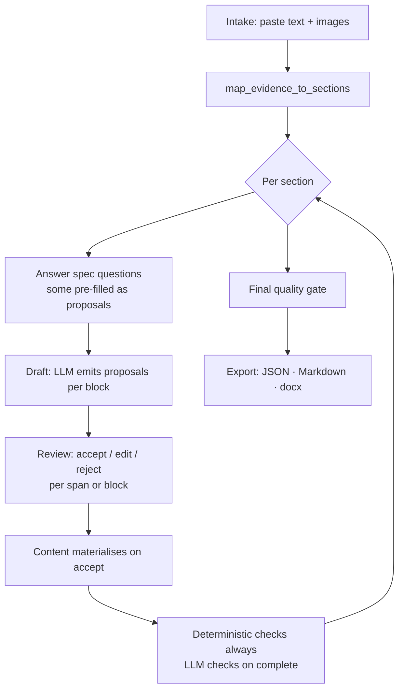

# Lancy Content Flow — Design Doc

> Status: **draft v0.2** · 2026-09-20 · companion: [ARCHITECTURE.md](ARCHITECTURE.md)

## 1. Premise

Lancy answers *"what does this corpus say?"* — it retrieves and condenses.

Lancy Content Flow (LCF) answers *"what does this document still need?"* — it elicits and
expands. Same LLM, opposite direction.

The temptation is to describe LCF as "an LLM that writes documents". That framing produces a chat
window with a download button, and it fails the moment a document has to satisfy someone else's
rules. LCF's actual job is narrower and harder:

> **Always know the delta between what the rule set demands and what the creator has supplied,
> and spend the creator's attention only on that delta.**

Generation is the easy part. **Gap detection is the product.**

## 2. The two invariants

Everything below follows from these. They are worth defending against every future convenience.

### I. Content exists only after a human accepted it

The LLM **never writes content**. It produces *proposals* against blocks. A proposal becomes
content the moment a person accepts it — unchanged, edited, or rejected. There is no code path by
which model output becomes document content without a human action.

This is not caution for its own sake. It makes three otherwise-expensive things free:

- **Traceability** is structural, not bookkeeping. A `git blame` over the document is just the
  revision log, and it is honest by construction.
- **The original input is preserved** automatically — it is a revision, and revisions are
  append-only.
- **An unsupported guess cannot become a compliance claim**, because someone put their name on
  every sentence that exists.

### II. The LLM is a worker inside a deterministic frame, never the frame

Section order, dependencies, gating, which calls happen and in what order, how results merge —
all of that is application logic in ordinary Python. The model answers narrow questions inside it.
This is what makes runs reproducible and failures attributable.

## 3. Roles

| Role | Owns | Works in |
|---|---|---|
| **Rule builder** | Document *types*: structure, questions, requirements, quality criteria, style, template | Spec editor |
| **Document creator** | Document *instances*: input, answers, accepted content, export | Guided flow |

The separation is not cosmetic. The rule builder encodes an organisation's standard once; the
creator consumes it many times and **cannot weaken it**. Otherwise every creator negotiates the
rules with the LLM individually, and the "standard" becomes whatever each person talked their way
into.

> **v1 scope:** the role boundary exists in the data model but is **not enforced** — no auth.

## 4. Three artifacts, kept apart

The architectural spine. If these bleed together, LCF degenerates into a Word editor with an LLM
bolted on.

```
┌──────────────────┐     ┌──────────────────┐     ┌──────────────────┐
│  1. SPEC         │     │  2. CONTENT      │     │  3. RENDERING    │
│                  │     │                  │     │                  │
│  Doc type:       │     │  Typed blocks,   │     │  JSON            │
│  sections,       │     │  revisions,      │     │  Markdown        │
│  questions,      │────▶│  accepted only   │────▶│  docx (template  │
│  requirements,   │     │                  │     │       + CI)      │
│  criteria, style │     │  format-agnostic │     │                  │
│                  │     │  never docx-     │     │  pure function   │
│  declarative,    │     │  shaped          │     │  of (1) + (2)    │
│  versioned       │     │                  │     │  re-runnable     │
└──────────────────┘     └──────────────────┘     └──────────────────┘
```

What this buys:

- Re-render an approved document under new branding without touching content.
- Export the same content as JSON, Markdown, or docx — no format is privileged.
- Diff two spec versions and see exactly which rule changed.
- Test the whole engine without producing a single Word file.

## 5. The spec model

A document type is a **declarative document** — versioned, YAML-serialisable, stored in Postgres.
The web UI is a structured editor over it. Import/export makes specs reviewable, diffable and
portable; putting them in a git repo is yours to do and needs nothing from us.

Worked examples: [4d-report.yaml](examples/4d-report.yaml) ·
[product-specification.yaml](examples/product-specification.yaml) ·
[8d-report.yaml](examples/8d-report.yaml)

### 5.1 Sections

```yaml
sections:
  - key: d4_root_cause
    title: "D4 — Root Cause Analysis"
    description: "..."        # shown to the creator
    guidance: "..."           # instructions to the LLM when drafting
    style: "..."              # optional section-level style override
    required: true
    depends_on: [d2_problem]
    uses_images: false        # may raw images be attached to this section's calls?
    questions: [...]          # answered before drafting unlocks
    blocks: [...]
    requirements: [...]
```

`depends_on` makes the flow a graph rather than a wizard, driving two mechanisms:

- **Readiness** — a section is `blocked` until its dependencies are `complete`.
- **Staleness** — when a completed section changes, everything downstream becomes `stale` and its
  checks re-run. Change the root cause in D4 and the app says D5 and D6 no longer follow.

### 5.2 Questions — the guided part of the guided flow

A section declares what the creator must supply before the LLM is allowed to draft it:

```yaml
questions:
  - key: containment_scope
    prompt: "What happened to stock already at the customer or in transit?"
    type: text          # text | choice | date | number | boolean
    required: true
    hint: "Sorted, blocked, recalled, or accepted with concession."
  - key: customer_informed
    prompt: "Was the customer formally notified?"
    type: boolean
    required: true
```

This is what makes the flow *guided* rather than the model improvising an interview. It also gates
drafting deterministically: **required questions answered → drafting unlocks.** No LLM judgement
involved in deciding whether we're ready.

Answers may be *pre-filled as proposals* from the intake material (§6.1) — but they are proposals,
so invariant I holds: the creator confirms them.

> Per section, questions and gaps are presented **all at once**, not one at a time. The
> section-by-section progression is the guide; within a section, a form is faster and no less
> guided.

### 5.3 Block kinds

A section's content is **not a string**. Five kinds, deliberately closed:

| Kind | Shape | Example |
|---|---|---|
| `prose` | restricted markdown (§9) | Problem description |
| `list` | ordered/unordered strings | Symptoms observed |
| `table` | typed columns, min/max rows | Corrective actions (action, owner, due, status) |
| `keyvalue` | fixed fields | Part number, customer, claim date |
| `image_ref` | evidence id + caption | Defect photograph |

Adding a sixth must be a deliberate decision. Every kind costs a renderer path, an editor
component, a check vocabulary and a docx mapping.

### 5.4 Requirements — two species

Deterministic assertions and LLM judgements, kept distinct so we never spend a model call on what
`!= null` can answer, and so the report states certainty where certainty exists.

**Deterministic** (structural, instant, free, never wrong):

| Kind | Checks |
|---|---|
| `present` | Block has non-empty content |
| `length` | min/max characters or words |
| `rows` | Table has min/max rows |
| `fields_filled` | Named columns non-empty in every row |
| `format` | Value parses as date / enum member / number |
| `cross_ref` | Every row in X references an id existing in Y |

**LLM judgements** (semantic, costed, confidence-bearing):

| Kind | Checks |
|---|---|
| `mentions` | "must mention the containment date and the responsible person" |
| `rubric` | free pass/fail judgement against written criteria |
| `consistency` | cross-section: "D5 actions must address the root cause named in D4" |

**A judgement must show its work.** A `mentions` check does not ask "what is
missing?" — asked that, a model answers without having to look, and produces
confident false negatives against content that plainly contains the point
(observed, repeatedly). It is asked instead for a verdict on *every* point with
the **exact words** that establish it, and a point counts as established only if
the quote is really in the content. The quote then goes into the report, so a
person can check the judgement rather than trust it.

Both species return the same envelope:

```json
{
  "id": "d5_addresses_root_cause",
  "result": "pass | fail | not_applicable | error",
  "severity": "blocker | warning",
  "reason": "human-readable, always populated on fail",
  "evidence": ["d4.causes[1]", "d5.actions[0]"],
  "confidence": 0.82          // LLM checks only
}
```

`error` is its own outcome because **"we could not check" is neither a pass nor a
failure**. Collapsing it into a pass would let an unreachable model quietly clear a
gate; collapsing it into a failure would condemn a document for an outage. An
errored blocker blocks export and says why.

### 5.5 Quality criteria

Document-scoped pass/fail criteria evaluated at the final gate. Structurally identical to
requirements — same envelope, same two species — differing only in *scope* and *when*. One check
engine, not two.

### 5.6 Style layers

Prompt and tone guidance composes from three tiers, each overriding or extending the one above:

| Tier | Ships with | Example |
|---|---|---|
| **System default** | Us | "Write plainly. No marketing language. Never state a fact the evidence does not support." |
| **Doc type** | Rule builder | "Formal register. Customer-facing. Explain internal abbreviations on first use." |
| **Section** | Rule builder | "Past tense, factual. No speculation — suspicion belongs in D4." |

We ship a sane default so a rule builder who writes nothing still gets good output. The rule
builder can extend it or replace it outright. Composition happens at call time and the resolved
style is logged with the call, so "why did it write it that way" is answerable after the fact.

### 5.7 Language

Language is a **variable on the document type**: `language: de | en`. The spec, its questions and
guidance, the generated content, the checks and the export all follow it. There is no translation
step and no mixed-language document.

The **UI is English only** in v1, regardless of document language.

### 5.8 Instructing the model

The model has to know what to do, and *what to do* varies per document type. So who writes that,
and in what form? The line:

> **The rule builder never writes prompt text.** They author artifacts; the artifacts happen to be
> useful to a model.

The test is a single question: **would a new employee benefit from reading this?** A section
description, a piece of drafting guidance, a hint on a field, a worked example — all yes. "Think
step by step", "you are an expert quality engineer", "respond only with JSON" — all no. Those are
ours, versioned with the code, and no rule builder ever sees them.

Get this wrong and the organisation's standard slowly turns into prompt engineering, which is
precisely what this product exists to prevent.

#### The checks are the instructions

The largest part of the answer needs no authoring at all. A requirement like:

```yaml
- id: problem_quantified
  kind: mentions
  block: description
  must_mention:
    - "the quantity or rate of affected parts"
    - "when the problem was first observed"
```

is simultaneously a pass/fail check *and* a drafting instruction. So the section's own requirements
are rendered into its drafting prompt as explicit targets: **the model is told exactly what it will
be graded on.** Written once, used twice, and the two can never drift apart — which is the same
reason `mentions` exists as a structured field rather than free prose.

#### What each authored field is for

| Field | Audience | Reaches the model as |
|---|---|---|
| `description` | The creator | Context: what this section is |
| `guidance` | Both | Drafting advice — the note a senior colleague would give |
| `hint` (block, question) | The creator | Field-level expectations |
| `style` | Both | Tone and register ([§5.6](#56-style-layers)) |
| `requirements` | The engine | Explicit targets to hit, and later the grade |
| `exemplar` | Both | A model answer, for tone and depth only |

Everything in that table is readable by a person and useful to one. Nothing in it is a prompt.

#### Exemplars are harvested, not written

Asking someone to invent a good example from nothing is hard, and hand-written examples go stale.
Instead: once real documents exist, the rule builder marks an **accepted block** as an exemplar for
its document type. The content already exists and a human already approved it, so the cost is one
click and the library improves as the tool is used.

Two guards, because few-shot examples have a specific failure mode — the model lifting *facts* from
the example into the new document:

1. **Fact-fenced.** The prompt labels exemplars explicitly: *this illustrates tone, structure and
   depth; its facts concern a different case and must not appear in your output.*
2. **Leakage detection.** A proposal sharing distinctive phrasing with an exemplar is flagged
   rather than shown as a clean draft.

Optional counter-exemplars — a bad example plus a note on why it fails — are often more
instructive than good ones. Same mechanism, inverted label.

#### Assembly, and being able to see it

A `draft_section` prompt is composed in fixed order:

```
1. Task frame          ours, fixed, never overridable
2. Resolved style      system default → doc type → section
3. Section spec        title, description, guidance, block definitions
4. Requirements        rendered as explicit targets
5. Exemplars           fact-fenced, if any
6. Runtime data        confirmed answers, mapped evidence, current content
7. Output schema       enforced by guided decoding
8. The never-invent rule   composed LAST so nothing above can soften it
```

The rule builder can **view the assembled prompt** for any section. They cannot edit it — but they
cannot debug what they cannot see, and "my guidance isn't working" is unanswerable otherwise. Every
call also stores its resolved prompt ([ARCHITECTURE §4](ARCHITECTURE.md#4-data-model)), so the
question is answerable weeks later too.

## 6. The creation flow



### 6.1 Intake

The entry point is a **paste field and image upload**, not a file importer. The creator dumps
whatever they have — a complaint email, meeting notes, measurement results, photos — and one call
(`map_evidence_to_sections`) distributes it across the spec's sections.

Sections that receive material get pre-filled question answers to confirm. Sections that receive
nothing become the question queue. That mapping *is* the first useful thing the app does.

**Intake may only point, never write.** Every assignment and every pre-filled answer carries a
quotation from the paste, and the quotation is checked against the paste before anything is stored —
the same rule the judged checks use, in [`llm/quoting.py`](../src/lcf/llm/quoting.py). A quote that
is not there is discarded, and the creator is told how many were. This is what makes it safe to run
mapping automatically on a paste rather than asking someone to approve each fragment: the worst a
wrong mapping can do is file a real sentence under the wrong heading, where a person will see it.

A pre-filled answer is stored with `source: proposed` and **does not count as answered**. It fills
the field in, shows the words it was read from, and drafting stays locked until a person saves it.
An answer the creator typed themselves is never overwritten by one the model derived.

Parsing uploaded PDF/DOCX files is a later convenience, not the primary path.

### 6.2 The section working surface

Arriving at a section, the creator sees three things at once:

1. **The block** — empty, or already carrying content derived from their pasted notes.
2. **What is still open** — every failing check and unanswered question, flagged together.
3. **Two ways forward** — write it themselves, or start the guided process.

The guided process can be run for **one section or a range of them**, because a creator who has
pasted good notes should not have to click through eight sections to confirm what is already there.

Questions then behave according to what the creator has already supplied:

| Situation | Behaviour |
|---|---|
| Their draft or notes already answer the question | Pre-fill the derived answer; they **confirm** it |
| Nothing in the material answers it | Ask, and **require** an answer before drafting unlocks |

This is the flexibility that earns the tool its place. A creator who pastes a thorough email
answers half the questions without typing; a creator who pastes two lines gets asked everything. In
both cases the same checks have to pass at the end.

**Answers are inputs to drafting, not content.** When a creator answers *"What happened to stock in
transit?"*, that answer feeds the `draft_section` call, which writes it into the block in the
document's register, guided by requirements and exemplars. The answer itself is preserved as
evidence, so nothing is lost and the blame view still traces the sentence back to what the person
actually said.

> Resolved: this replaces the earlier idea of a per-question flag deciding whether an answer became
> content directly. One path is simpler and the exemplar mechanism gives us consistent register
> without it.

### 6.3 The proposal model

Every LLM contribution is a row, not a mutation:

```
proposal
  block_id, anchor (span or whole-block), proposed_value,
  rationale, based_on [evidence ids], confidence,
  status: pending | accepted | accepted_edited | rejected
```

Accepting one appends a **revision** to the block. Rejecting it keeps the record. The block's
current value is its latest revision; its history is the audit trail; blame is a diff over that
history.

In the UI this is a marked span with a hover card: the proposal, why, what it was based on, and
accept / reject / edit-in-place. For a still-empty block it is a full-block proposal instead.

### 6.4 Narrow calls, flexible context

The invariant is on **output scope**, not input context:

> One call answers one question and returns one schema.

How much context that call receives is a separate, tactical decision. Send the whole evidence pool
when it fits and helps; send a summary when it doesn't. When a document outgrows the window, a
`summarize` call produces rolling per-section summaries that stand in for the raw material.

Narrow output scope is what buys us:

| Property | Why |
|---|---|
| **Reliability** | Small schemas are satisfied far more often than large ones, even under guided decoding |
| **Attribution** | One call produced it, not a 30k-token blur |
| **Retryability** | Re-run one section or one check, not the document |
| **Cost** | Unchanged sections are never re-sent |
| **Parallelism** | Independent sections and checks run concurrently |

Composition — which calls, in what order, merged how — is application logic. See invariant II.

### 6.5 Images

A document may hold any number of images; only the **per-call** budget is fixed (4 for the current
model, and it is configuration, not a constant).

1. **At upload** — images are captioned in batches within the budget. The caption plus any
   user-supplied label is stored as *text* evidence, permanently. This is what decouples
   document-level image count from per-call limits: afterwards every image has a textual
   representation that travels freely.
2. **During drafting** — captions always travel, being cheap text. Raw images are re-attached only
   for sections declaring `uses_images: true`, within budget, chosen by *user-pinned >
   assigned-to-this-section > most recent*. A section needing more gets multiple scoped calls.
3. **Provenance** — a proposal derived solely from an image carries `confidence: low` and says so.
   Invariant I already requires confirmation, so nothing extra is needed to keep vision honest.

### 6.6 Revisions and blame

Every block carries an append-only revision log:

```
revision
  block_id, seq, value, author: user | llm_accepted | llm_accepted_edited,
  proposal_id, created_at
```

The blame view diffs consecutive revisions and attributes spans to the revision that introduced
them — the same way `git blame` works, and for the same reason: storing per-character attribution
is fragile, recomputing it from history is not.

The creator's **original pasted input is never overwritten**. It lives in the evidence pool as the
document's first fact, and every proposal that drew on it says so.

### 6.7 When checks run

| Trigger | What runs | Cost |
|---|---|---|
| Every edit | Deterministic checks for the block | Free |
| Section marked complete | Section-scoped LLM checks | One call per check |
| Explicit "re-run" button | Whatever the creator asks for | On demand |
| Final gate | Everything, document-wide | A batch of parallel calls |

Re-running the gap engine after every answer would be expensive and annoying. It runs on request
and on section completion — and the manual re-run is always available.

## 7. The quality gate

A report, not a bare verdict:

```
BLOCKER  ✗  Root cause traceability — D5 action "retrain operators" does not
            address the root cause identified in D4 ("incorrect torque spec in
            work instruction WI-4471").  → d4.causes[1], d5.actions[0]

WARNING  ✗  D7 preventive measures reference no other product lines, though D2
            identifies a shared component.

PASS     ✓  17 further criteria
```

Export is **blocked** on unresolved blockers. Override requires a written reason and is recorded
permanently — because someone will eventually need to ship a report the tool thinks is incomplete,
and recording that decision beats pretending it won't happen.

## 8. Output

Three exports off one canonical representation, none privileged:

| Format | Purpose |
|---|---|
| **JSON** | Canonical. Sections, typed blocks, revisions, assessment. The machine-readable handover — to an ERP, a DMS, or the next tool in the chain |
| **Markdown** | Human-readable, diffable, pasteable. Falls straight out of the block model |
| **docx** | The deliverable, via docxtpl: a real Word template with logo, fonts and CI already applied, `{{ }}` tags where content goes |

One template per document type, versioned with it. Template tags are linted against spec keys at
publish time, so a template referencing a section that no longer exists fails then — not at export
time in front of a customer.

LCF's job ends at export. The document's life continues elsewhere: an ERP, a DMS, a customer
portal. That is why the JSON export is a first-class output and not an afterthought.

## 9. Markdown integrity

Prose blocks are markdown, which raises the obvious question: how does formatting survive an LLM
edit? Three mechanisms, and the third does most of the work.

**1. A restricted subset.** Prose blocks allow paragraphs, `**bold**`, `*italic*`, `` `code` ``,
bullet and numbered lists, links, and line breaks. Explicitly not allowed:

- **Headings** — structure is the spec's job. A model that can emit `##` can invent sections.
- **Tables and images** — they are their own block kinds and cannot be mangled by prose editing.
- **Raw HTML** — no.

**2. AST normalisation.** Every LLM output is parsed to a markdown AST server-side and re-rendered
canonically. Anything outside the subset is dropped or downgraded. Malformed markdown never
reaches storage, so the editor never has to cope with it.

**3. Span-scoped proposals.** A suggestion targets a span, not a block. The surrounding formatting
is never in the model's output at all, so it cannot be damaged. This is the real defence — the
other two are backstops.

The editor is a ProseMirror document with markdown serialisation, so the structure is a typed tree
in the browser too. Formatting is never a string being pattern-matched.

## 10. Worked examples

Three specs, chosen so the engine cannot quietly grow 8D-shaped assumptions.

| Spec | Role |
|---|---|
| [**4d-report.yaml**](examples/4d-report.yaml) | The demo. Team, problem, containment, root cause — a genuine interim report, and literally a prefix of the 8D |
| [**product-specification.yaml**](examples/product-specification.yaml) | The generality proof. A few chapters, a few boxes to tick, no domain knowledge needed to judge the result |
| [**8d-report.yaml**](examples/8d-report.yaml) | The stress test. Everything the model must survive |

The 4D → 8D relationship is also how it works in practice: a 4D goes out within days, and is
escalated to a full 8D once root cause is confirmed. That escalation is a live demonstration of
spec versioning and extension, and it costs us nothing because both specs already exist.

What 8D forces on the design:

| 8D reality | What it forces |
|---|---|
| D4 feeds D5/D6; D3 precedes D4 by weeks | Dependency graph + staleness, not a wizard |
| 5-Why chains, Ishikawa, action tables | Typed blocks, not prose strings |
| Customer-facing, auditable | Revisions, blame, recorded overrides |
| "Root cause must be addressed by corrective action" | Cross-section consistency checks |
| Defect photographs are the densest input | Image evidence, bounded and confirmed |

## 11. Relationship to lancy

Shared name, shared taste, no shared code. LCF is its own service with its own schema, free to use
whatever technology suits it — which is why it is a single Python service rather than lancy's
split frontend and backend.

Lancy could one day supply reference material (past reports, standards, work instructions) as
input. It is not a goal, not planned, and no interface for it exists in this design. If it becomes
wanted, it is a feature then — not scaffolding now.

## 12. Non-goals for v1

- **Auth.** No users, no login. Role boundaries modelled, not enforced.
- **Collaborative editing.** One creator per document at a time. No locking, no CRDT.
- **Approval workflows.** Status field exists; no routing, no signatures.
- **Retrieval.** Evidence in context, summarised when large. No embeddings, no chunking.
- **File import.** Paste and images are the entry point; PDF/DOCX parsing comes later.
- **Multi-tenancy.** Single installation.
- **Translation.** One language per document type, end to end.
- **Doc type migration.** Documents pin their spec version; upgrading in-flight is later.

## 13. Decisions on record

| # | Decision |
|---|---|
| 1 | Documents **inherit and pin** the spec version they started on. Upgrading is explicit and shows a diff |
| 2 | Language is a **document-type variable** (DE/EN in v1), applied end to end. UI stays English |
| 3 | **One docx template per document type**, versioned with it, tags linted at publish |
| 4 | Immutable/WORM export is **out of scope** — LCF supports creation; the document's lifecycle continues in an ERP or DMS |
| 5 | The **section** is the unit of guidance; within a section everything is flagged at once |
| 6 | Checks re-run on completion and on request, never on keystroke. Manual re-run always available |
| 7 | **Single Python service**, server-rendered, with JS islands where interactivity demands it |
| 8 | **Inline span-level** suggestions via ProseMirror decorations |
| 9 | Git integration is **export/import only** — specs are YAML; version control them yourself |
| 10 | The rule builder **never writes prompt text**. They author artifacts a human would also benefit from reading ([§5.8](#58-instructing-the-model)) |
| 11 | Requirements are **rendered into the drafting prompt** as explicit targets. Written once, used as instruction and as grade |
| 12 | Exemplars are **harvested from accepted content**, not hand-written. Fact-fenced, tone-only |
| 13 | Question answers are **inputs to drafting**, never content directly ([§6.2](#62-the-section-working-surface)) |
| 14 | Declined proposals are **buried but logged** ([§14.1](#141-the-decision-log)) |
| 15 | A change to a completed section **names its dependents and asks**, rather than marking them stale silently ([§14.2](#142-staleness-asks-rather-than-assumes)) |
| 16 | Tables accept **pasted spreadsheet cells** ([§14.3](#143-tables-are-pasted-not-typed)) |

## 14. Resolved details

Small decisions with outsized effects on whether the tool is pleasant to use.

### 14.1 The decision log

Declined proposals are **not shown inline** — a document littered with rejected suggestions is
unreadable. They appear in a **decision log** in a collapsed strip at the foot of the working
surface:

```
▸ Decisions (3)
    14:22  user   declined   "The root cause was determined to be operator error."
    14:25  user   accepted, edited   D4 · causes[1]
    14:31  user   declined   "Containment was fully effective."
```

Entry, actor, timestamp, and the text that was turned down. Out of the way by default, one click
away when someone asks why the document says what it says. The rows already exist in the schema —
this is purely a presentation decision.

### 14.2 Staleness asks rather than assumes

Marking every dependent section stale on every upstream edit punishes typo fixes, and a "this was
cosmetic" checkbox just becomes a button everyone clicks without reading.

Instead, on editing a completed section the creator is **told what depends on it and asked**:

```
You changed D4 — Root Cause Analysis.

Two sections were built on it:
  D5 — Permanent Corrective Actions    [ still valid ]  [ needs rework ]
  D6 — Implement and Validate          [ still valid ]  [ needs rework ]
```

A specific, answerable question about named sections, rather than a generic escape hatch. The
person who just made the change is the one who knows whether it mattered — and the answer is
recorded, so an assessor can see who decided D5 still stood.

### 14.3 Tables are pasted, not typed

Most table content already exists in a spreadsheet. Every `table` block accepts a **paste target**
that parses clipboard TSV/CSV into rows, maps the columns, and shows what it matched before
committing:

| Pasted column | → | Spec column |
|---|---|---|
| "Maßnahme" | → | `action` |
| "Verantwortlich" | → | `owner` |
| "Termin" | → | `due_at` |

Column mapping is confirmed once and remembered per document type. Row-by-row typing remains
available; nobody should have to use it.

### 14.4 Still open

1. **Spec editor for tables.** Defining columns and types through a web form is the fiddliest part
   of the rule builder UI. A raw-YAML mode is the obvious escape hatch — but two editing paths for
   one artifact is the kind of thing that rots. Decide when the spec editor gets built (step 10).
2. **Exemplar scope.** Are exemplars per block, per section, or per document type? Per block is
   most precise and most work to curate. Defer until there is real accepted content to harvest —
   the answer will be obvious then and guessing now is wasted.
